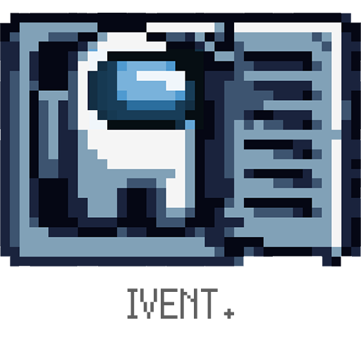

<p align="center">
    
</p>

Global keyboard and mouse hook library for Go: hotkeys, sequences, double taps, holds,
per-application bindings, shortcut recording, event blocking and key sending.

## Warning
- This package is in an early stage and may undergo breaking changes.
- Supported platforms: macOS, Windows and Linux (see [Platform notes](#platform-notes)).

## Install
```bash
go get github.com/ironpark/ivent
```

## Usage
```go
package main

import (
	"context"
	"fmt"
	"log"
	"os"
	"os/signal"
	"time"

	"github.com/ironpark/ivent"
)

func main() {
	h := ivent.New()

	// Left or right Ctrl + Shift + A
	h.Bind("Ctrl+Shift+A", func(e ivent.Event) {
		fmt.Println("Ctrl+Shift+A in", e.App().Name)
	})
	// Sequence (VS Code style chord)
	h.Bind("Ctrl+K Ctrl+C", func(ivent.Event) { fmt.Println("chord") })
	// Shift pressed twice quickly
	h.Bind("Shift", func(ivent.Event) { fmt.Println("double Shift") }, ivent.DoubleTap(300*time.Millisecond))

	ctx, stop := signal.NotifyContext(context.Background(), os.Interrupt)
	defer stop()
	// Blocks until ctx is done. Callbacks run one at a time on a goroutine owned by Run.
	if err := h.Run(ctx); err != nil {
		log.Fatal(err) // ivent.ErrHookFailed: e.g. missing permission on macOS
	}
}
```

More in [`examples/`](./examples): `hotkey` shows every binding option, `logger` prints raw events.

### Bindings
`Bind` parses a combination (`"Ctrl+Shift+A"`, spaces around `+` are fine) or a space-separated sequence
(`"Ctrl+K Ctrl+C"`) and returns a function that removes the binding. `BindCombo` / `BindSequence` take
`key.Combo` values. Invalid option combinations return `ErrInvalidBinding`, and binding the same input twice
returns `ErrDuplicateBinding`. `Bindings()` lists what is registered.

| Option | Effect |
|---|---|
| (default) | Fires when exactly the keys of the combination are held |
| `Contains()` | Also fires when other keys are held too |
| `Repeat()` | Also fires on auto-repeat |
| `OnRelease()` | Fires on release if no other key was pressed meanwhile (e.g. tap `Cmd` alone) |
| `DoubleTap(d)` | Fires when the combination is pressed twice within `d` |
| `Hold(d)` | Fires once the combination has been held for `d` |
| `Suppress()` | Blocks the triggering key so other apps never see it |
| `OnlyApps(...)` / `ExceptApps(...)` | Restricts by focused app name, bundle ID or executable |
| `ByCharacter()` | Resolves `"Z"`, `"/"`, ... by the current keyboard layout instead of US key positions |
| `Async()` | Runs the callback on its own goroutine instead of the shared, ordered one |
| `SequenceTimeout(d)` | Longest pause between the steps of a sequence (default 2s) |

In a sequence, trigger options such as `Hold` or `DoubleTap` apply to the last step.

### Recording shortcuts and pausing
```go
combo, err := h.Record(ctx)     // waits for the user to press a combination, e.g. in a settings screen
fmt.Println(combo.Display())     // "⌃⇧A" on macOS, "Ctrl+Shift+A" elsewhere
h.BindCombo(combo, fn)

h.Pause()                        // stop all bindings (e.g. while a game is focused)
h.Resume()
```

### Keys and modifiers
- `Ctrl`, `Alt`, `Shift` and `Super` (also `Control`, `Option`, `Cmd`, `Command`, `Win`, `Meta`) match either the
  left or the right key. Use `LeftCtrl`, `RightCmd`, ... to require a side.
- Mouse buttons are keys too: `"Ctrl+MouseLeft"`.
- Key names describe physical key **positions** on a US layout (on AZERTY, `"A"` is the key labelled Q),
  unless the binding uses `ByCharacter()`.
- `key.ParseCombo` / `Combo.String()` convert combinations to and from text; `Combo.Display()` /
  `Combo.Format(style)` produce text for people. Write the `+` key as `Plus` (or `Ctrl++`).
- Keys that do not exist on a platform (such as `key.Fn` on Windows) compile everywhere and never match.

### Testing your bindings
`iventtest` drives a `Hook` with simulated input, without an OS hook or permissions:
```go
h := ivent.New()
h.Bind("Ctrl+K Ctrl+C", comment)
sim := iventtest.New(h)
sim.Type("Ctrl+K Ctrl+C")
sim.Flush() // runs the callbacks
```

### Raw events, sending and permissions
```go
for e := range h.Events() { ... }                 // every key, button, move and wheel event
ivent.SendString("Cmd+C")                         // send a key combination
ivent.WaitForPermission(ctx, ivent.Permission{Monitor: true, Control: true}) // ask and wait (macOS)
```

### Options
| Option | Effect |
|---|---|
| `WithInjected()` | Also processes input synthesized by other software (ignored by default) |
| `WithExclusive()` | Linux: grabs keyboards so `Suppress` can block keys (see [Platform notes](#platform-notes)) |
| `WithoutMouse()` | Listens to the keyboard only |
| `WithBuffer(n)` | Pending callback / event buffer size (default 256) |
| `WithWarnings(fn)` | Receives `ErrCannotSuppress` / `ErrCallbacksDropped` (logged with `log/slog` by default) |

## Platform notes
| | macOS | Windows | Linux |
|---|---|---|---|
| Listen | Input Monitoring permission | ✓ | root or `input` group (evdev) |
| `Suppress` | Accessibility permission | ✓ | `WithExclusive()` + `/dev/uinput`, keyboards only |
| `Send` | Accessibility permission | ✓ | `/dev/uinput` write access |
| `ByCharacter` | ✓ | ✓ | ✗ (US positions) |
| Mouse position | ✓ | ✓ | ✗ (buttons and wheel only) |
| `Event.App`, `OnlyApps` | ✓ | ✓ | ✗ |
| Stuck key recovery | ✓ | ✓ | ✓ |
| Keyboards plugged in later | ✓ | ✓ | ✓ |

- Blocking is enabled automatically when possible; `Hook.CanSuppress` tells whether it is, and a warning is
  reported for `Suppress` bindings that cannot block.
- On macOS, Input Monitoring usually takes effect only after the process restarts; Accessibility applies at once.
- Missed key releases (secure input, sleep, a disabled event tap) are recovered by checking the OS key state.
- On Windows, the fake Left Ctrl sent by AltGr is ignored, so AltGr does not trigger `Ctrl+Alt` bindings.
- Detection of synthesized input is a heuristic on macOS. On Linux, input from any virtual device counts
  as synthesized, including remappers such as keyd; use `WithInjected()` with them.
- On Linux, `WithExclusive()` grabs physical keyboards so only this process receives their input, and
  passes every key it does not block on through a virtual device (Caps Lock and other LEDs keep working).
  A keyboard is grabbed once none of its keys is held. If the process stops responding, keyboards stop
  working until it exits. The Linux backend reads evdev directly, so it works the same on X11, Wayland
  and the console.
- To use `/dev/uinput` without root, add a udev rule such as
  `KERNEL=="uinput", GROUP="input", MODE="0660", OPTIONS+="static_node=uinput"` and load the `uinput` module.

## TODO
- [ ] Mouse position, `Event.App` and `ByCharacter` on Linux (X11 / Wayland)
- [ ] Sending mouse events
